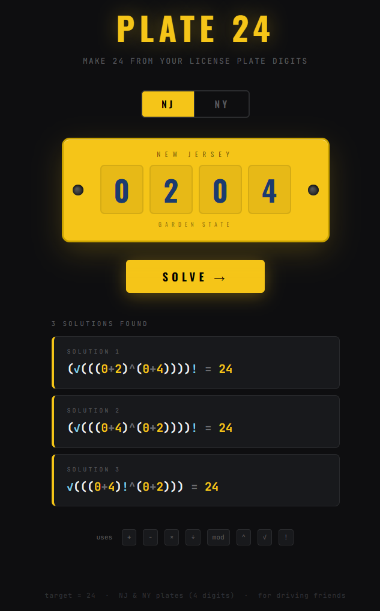

# Plate 24

Make **24** from the 4 digits on a New Jersey or New York license plate.



Supports: `+` `−` `×` `÷` `mod` `^` `√` `!`

Live at **[game24-4bf.pages.dev](https://game24-4bf.pages.dev)**

---

## Deploy free on Cloudflare Pages

**Option A — Cloudflare dashboard (no CLI needed):**

1. Go to [dash.cloudflare.com](https://dash.cloudflare.com) → Workers & Pages → Create → Pages → Upload assets
2. Name your project, drag in `index.html`, click **Deploy site**

**Option B — CLI:**

```bash
npx wrangler pages deploy . --project-name plate-24
```

---

dedicated to 76 117 99 121.
